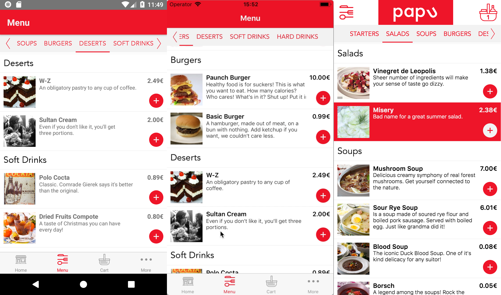

> Working PWA demo here - [papuyumyum.herokuapp.com](https://papuyumyum.herokuapp.com). Best to view on mobile

## What da? 🧐

This little project is my humble attempt two bridge to worlds 🚠. The world of web apps and the world of native apps. Using [react native](https://facebook.github.io/react-native/) and [react dom](https://reactjs.org/). Majority of code share the same base. This means that almost every screen and component you see is a universal one, shared between those two platforms. This reduces the codebase to maintain, thus reducing the cost of development 💰!


### What does it do?

It's a simple e-commerce food app. Find something you fancy in the menu, add it to the cart and buy it! To pass the checkout process use fake credit card credentials:

```
number: 4242 4242 4242 4242
CVV: any 3-digit number
MM: double digit month
YYYY: 4-digit year
```

## W🐞tch 🕷ut f🐜r bu🐛s!

This code is still really messy! There's no proper error handling, some things don't work, some screens are fake. This was just supposed to be a proof of concept.

## Tech stack 🛠

- [ReactJS](https://reactjs.org) via [create-react-app](https://github.com/facebook/create-react-app) - web rendering and PWA functionality in one neat package
- [React Native](https://facebook.github.io/react-native/) - native rendering
- [React Native Web](https://github.com/necolas/react-native-web) - the most important module, that makes all the magic hapen.
- [React Navigation](https://reactnavigation.org/) - navigation framework for the native app
- [React Router](https://reacttraining.com/react-router/web) - navigation framework for the web app
- [React Redux](https://redux.js.org/) - state managment
- [React Saga](https://redux-saga.js.org/) - redux middleware side effects manager
- [Moltin](https://moltin.com) - e-commerce platform offering great backend with fantastic API

## Challenges 💪

One of the biggest challenges was to create a universal way of navigating between the screens. Native platform uses great lib React Navigation, while web one uses React Router Web. There is a custom HOC to bridge them both, and enable coherent api.

React Native Web is a great lib. Without it, the whole project would be impossible to exist. Still it lacks some functionality, components and it's sometimes buggy, so you need to be creative to find your own solutions.

## Building and contributing

If you want to check the code yourself, make some changes or add something to it you are more then welcome!
You need to have create-react-app scripts installed
Fork or clone the repo and run:

```
yarn install
```

or

```
npm install
```

Here are the scripts:

`yarn start` - run the native react metro bundler

`yarn start-ios` - run the native react ios app in iOS Simulator

`yarn start-web` - run the react web app in the browser

`yarn build` - build the web app

## To do 📋

- a module to provide a coherent way to navigate on both platforms
- proper error handling
- bug fixes

Thanks for your time and have fun!
